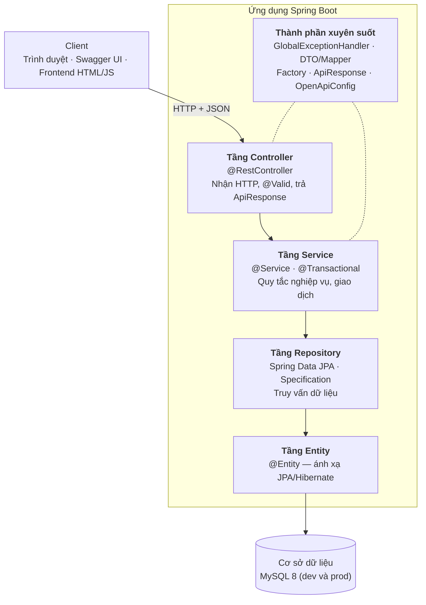
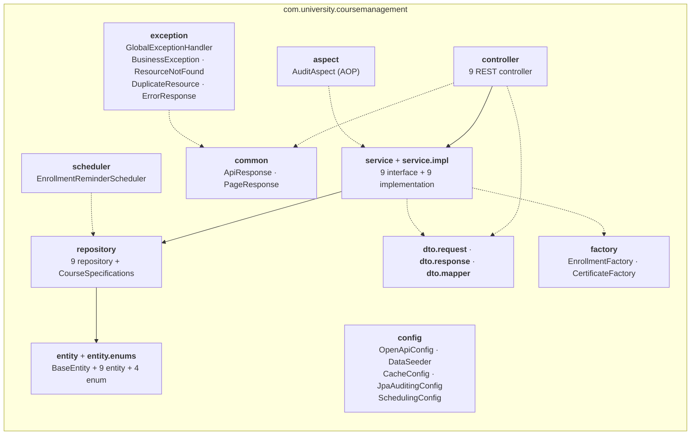
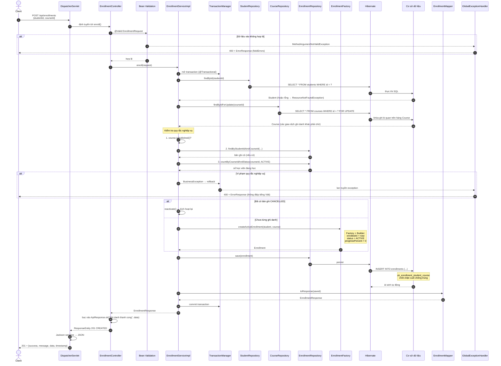
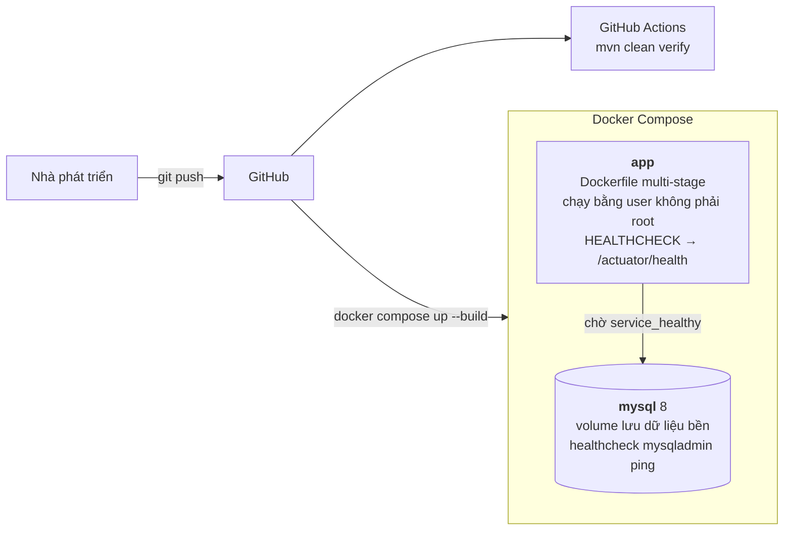

# Kiến trúc hệ thống

> Hệ thống quản lý khóa học — Đồ án cuối kỳ **Lập trình ứng dụng với Java (14113014)**
> Tài liệu đi kèm: [Thiết kế cơ sở dữ liệu](./database-schema.md) · [DDL](./schema.sql)

---

## 1. Tổng quan kiến trúc

Hệ thống áp dụng **Layered Architecture** (kiến trúc phân tầng) — mỗi tầng chỉ được gọi tầng
ngay bên dưới, không gọi vượt tầng và không gọi ngược lên.



**Nguyên tắc phụ thuộc:** Controller → Service → Repository → Entity. Ngược lại là **cấm**.
Nhờ vậy đổi tầng trình bày (thêm giao diện khác, thêm GraphQL) không ảnh hưởng nghiệp vụ;
đổi CSDL không ảnh hưởng Controller.

**Ranh giới DTO ↔ Entity:** Controller chỉ làm việc với DTO, không bao giờ nhận hoặc trả về
Entity. Việc chuyển đổi do lớp `Mapper` đảm nhận.

```
Request JSON → RequestDTO → (Mapper) → Entity → CSDL
CSDL → Entity → (Mapper) → ResponseDTO → Response JSON
```

---

## 2. Sơ đồ package



| Package | Trách nhiệm |
|---|---|
| `controller` | Điểm vào HTTP. Khai báo route, ràng buộc `@Valid`, phân trang `Pageable`, gói kết quả vào `ApiResponse`. Không chứa nghiệp vụ |
| `service` / `service.impl` | Tách interface khỏi cài đặt. Chứa toàn bộ quy tắc nghiệp vụ và ranh giới `@Transactional` |
| `repository` | Kế thừa `JpaRepository`; `CourseSpecifications` xây dựng điều kiện lọc động |
| `entity` / `entity.enums` | Ánh xạ bảng CSDL. `BaseEntity` là `@MappedSuperclass` dùng chung |
| `dto.request` | Dữ liệu vào, mang annotation Bean Validation (`@NotBlank`, `@Min`, `@Email`…) |
| `dto.response` | Dữ liệu ra, chỉ chứa trường cần hiển thị |
| `dto.mapper` | Chuyển đổi Entity ↔ DTO, là bean Spring nên tiêm được vào Service |
| `exception` | Exception nghiệp vụ + `@RestControllerAdvice` xử lý lỗi tập trung |
| `factory` | Factory Pattern — `EnrollmentFactory` (khởi tạo ghi danh), `CertificateFactory` (sinh mã chứng chỉ) |
| `aspect` | `AuditAspect` — ghi nhật ký thao tác bằng AOP, không chèn code vào Service |
| `scheduler` | `EnrollmentReminderScheduler` — job `@Scheduled` nhắc học viên lâu không hoạt động |
| `common` | `ApiResponse` (bao phản hồi thống nhất), `PageResponse` (bao kết quả phân trang) |
| `config` | `OpenApiConfig` (Swagger), `DataSeeder` (dữ liệu mẫu profile `dev`), `CacheConfig` (`@EnableCaching`), `JpaAuditingConfig` (`@EnableJpaAuditing`), `SchedulingConfig` (`@EnableScheduling`) |

---

## 3. Luồng dữ liệu đầy đủ: `POST /api/enrollments`

Đây là luồng nghiệp vụ phức tạp nhất hệ thống — ghi danh học viên vào khóa học.



### Quy tắc nghiệp vụ được kiểm tra ở tầng Service

| # | Quy tắc | Lỗi trả về |
|---|---|---|
| 1 | Học viên phải tồn tại | `404` — `ResourceNotFoundException` |
| 2 | Khóa học phải tồn tại | `404` — `ResourceNotFoundException` |
| 3 | Khóa học phải ở trạng thái `PUBLISHED` | `400` — "Khóa học chưa được xuất bản" |
| 4 | Chưa có bản ghi ghi danh `ACTIVE`/`COMPLETED` | `400` — "Học viên đã ghi danh khóa học này" |
| 5 | Số học viên `ACTIVE` phải nhỏ hơn `capacity` | `400` — "Khóa học đã đầy (n/m)" |

**Vì sao khóa bi quan ở bước nạp `Course`?** Bước 5 là kiểm tra dạng "đếm rồi mới ghi" — hai
bước tách rời. Không có khóa, hai request đồng thời vào chỗ trống cuối cùng đều đếm thấy "còn
chỗ" và đều ghi thành công. `@Version` **không** cứu được vì nó chỉ bảo vệ việc ghi đè trên
chính bản ghi `Course`, trong khi luồng này không `UPDATE` dòng `Course` nào. Số liệu đo được
xem tại [`toi-uu-hieu-nang.md`](./toi-uu-hieu-nang.md).

**Vì sao kiểm tra ở Service mà không ở Controller?** Controller chỉ chịu trách nhiệm về giao
thức HTTP. Quy tắc nghiệp vụ đặt ở Service để có thể tái sử dụng khi gọi từ nơi khác (job định
kỳ, import hàng loạt, giao diện khác) và để nằm trọn trong ranh giới transaction — nếu một quy
tắc thất bại, toàn bộ thay đổi được rollback, không để lại bản ghi mồ côi.

---

## 4. Thành phần xuyên suốt (cross-cutting)

Ba cơ chế dưới đây hoạt động **không cần sửa tầng Service**, nhờ proxy do Spring tạo.

| Cơ chế | Kích hoạt bởi | Chạy khi nào | Áp dụng ở đâu |
|---|---|---|---|
| **Cache** | `@EnableCaching` + `@Cacheable` / `@CacheEvict` | Trước khi vào phương thức: có cache thì trả luôn, không gọi Service | `CategoryServiceImpl.getAllSimple`, `CourseServiceImpl.getStatistics` |
| **Audit log (AOP)** | `@Aspect` + `@AfterReturning` | Sau khi phương thức ghi chạy xong **và** giao dịch đã commit | Mọi `*ServiceImpl` có phương thức `create*`/`update*`/`delete*`/`publish*`/`archive*`/`enroll*`/`cancel*` |
| **JPA Auditing** | `@EnableJpaAuditing` + `AuditorAware` | Khi Hibernate lưu entity | `created_by` / `updated_by` trên mọi bảng |
| **Job định kỳ** | `@EnableScheduling` + `@Scheduled` | 8h sáng mỗi ngày | `EnrollmentReminderScheduler` |

### Thứ tự các lớp proxy

```
Request
  → AuditAspect        (@Order(1) — ngoài cùng)
    → Cache proxy      (@Cacheable / @CacheEvict)
      → Transaction proxy (@Transactional)
        → phương thức Service thật
```

`AuditAspect` đặt `@Order(1)` để nằm **ngoài** proxy giao dịch (proxy giao dịch có độ ưu tiên
thấp nhất). Nhờ vậy `@AfterReturning` chỉ chạy sau khi giao dịch nghiệp vụ đã commit thành công
— không ghi nhật ký cho thao tác bị cuộn ngược.

`AuditLogService.record` lại chạy trong giao dịch **riêng** (`REQUIRES_NEW`): nhật ký là dữ liệu
quan sát, không được phép làm hỏng nghiệp vụ.

---

## 5. Xử lý lỗi tập trung

`GlobalExceptionHandler` được đánh dấu `@RestControllerAdvice`. Spring bọc mọi Controller bằng
cơ chế này: khi một exception thoát ra khỏi Controller, Spring tìm phương thức `@ExceptionHandler`
khớp kiểu và dùng nó để tạo phản hồi.

| Exception | HTTP | Ghi chú |
|---|---|---|
| `MethodArgumentNotValidException` | 400 | Sinh từ `@Valid`, kèm danh sách `fieldErrors` |
| `BusinessException` | 400 | Vi phạm quy tắc nghiệp vụ |
| `ResourceNotFoundException` | 404 | Không tìm thấy bản ghi |
| `DuplicateResourceException` | 409 | Trùng dữ liệu duy nhất (email, tên danh mục) |
| Exception khác | 500 | Log lại, không lộ stack trace ra client |

Lợi ích: Controller không cần `try/catch`, định dạng lỗi thống nhất trên toàn bộ API, và khi
đổi cách trả lỗi chỉ phải sửa một chỗ.

---

## 6. Danh mục API

Tổng cộng **42 endpoint** chia theo 9 nhóm tài nguyên. Tài liệu tương tác tại
`http://localhost:8080/swagger-ui.html`.

| Nhóm | Đường dẫn gốc | Số endpoint | Chức năng chính |
|---|---|---|---|
| Categories | `/api/categories` | 6 | CRUD danh mục, danh sách phân trang + `/all` cho dropdown |
| Instructors | `/api/instructors` | 6 | CRUD giảng viên |
| Students | `/api/students` | 6 | CRUD học viên |
| Courses | `/api/courses` | 8 | CRUD, tìm kiếm có lọc động, `/statistics`, `publish`, `archive` |
| Lessons | `/api/courses/{id}/lessons`, `/api/lessons/{id}` | 4 | Quản lý bài học trong khóa |
| Enrollments | `/api/enrollments` | 5 | Ghi danh, xem theo học viên/khóa học, cập nhật tiến độ, hủy |
| Reviews | `/api/courses/{id}/reviews`, `/api/reviews/{id}`, `/api/courses/top-rated` | 5 | Đánh giá 1–5 sao, danh sách đánh giá, bảng xếp hạng |
| Certificates | `/api/certificates` | 3 | Tra cứu chứng chỉ theo mã / học viên / ghi danh |
| Audit Logs | `/api/audit-logs` | 1 | Nhật ký thao tác (chỉ đọc, có lọc và phân trang) |

**Quy ước chung:**

- Mọi phản hồi thành công đều bọc trong `ApiResponse<T>`: `{ success, message, data, timestamp }`.
- Endpoint danh sách đều nhận `Pageable` (`page`, `size`, `sort`) và trả về `PageResponse<T>`.
- Endpoint đổi trạng thái dùng `PATCH` (`/publish`, `/archive`, `/cancel`, `/progress`) đúng
  ngữ nghĩa HTTP — sửa một phần tài nguyên, không thay thế toàn bộ như `PUT`.

---

## 7. Công nghệ sử dụng

| Thành phần | Công nghệ | Vai trò |
|---|---|---|
| Ngôn ngữ | Java 17 | Bản LTS, dùng `record` cho DTO, `.formatted()` cho chuỗi |
| Framework | Spring Boot 3.4.1 | IoC container, auto-configuration |
| Web | Spring Web MVC | `DispatcherServlet`, `@RestController` |
| Truy cập dữ liệu | Spring Data JPA + Hibernate 6.6 | ORM, sinh repository, Specification API |
| Kiểm tra dữ liệu | Jakarta Bean Validation | `@NotBlank`, `@Email`, `@Min`, `@Max` trên DTO |
| Tài liệu API | springdoc-openapi | Sinh OpenAPI 3 + Swagger UI |
| Giám sát | Spring Boot Actuator | `/actuator/health` cho Docker healthcheck |
| AOP | Spring AOP (`spring-boot-starter-aop`) | Ghi nhật ký thao tác không xâm lấn |
| Cache | Spring Cache (`spring-boot-starter-cache`) | `@Cacheable` / `@CacheEvict` |
| Job định kỳ | Spring Scheduling | `@Scheduled` nhắc học viên |
| Tiện ích | Lombok | `@Getter`, `@Builder` — giảm mã lặp |
| CSDL | MySQL 8 (dev và prod) | H2 in-memory chỉ dùng cho bộ test tự động |
| Build | Maven + Maven Wrapper | Chạy được không cần cài Maven sẵn |
| Đóng gói | Docker multi-stage + Docker Compose | |
| CI | GitHub Actions | Build + test mỗi lần push |
| Frontend | HTML/CSS/JavaScript thuần + Fetch API | Không phụ thuộc framework |

---

## 8. Cấu hình theo môi trường (Spring Profiles)

| Cấu hình | `dev` | `prod` | `test` |
|---|---|---|---|
| CSDL | **MySQL 8** | **MySQL 8** | H2 in-memory |
| `ddl-auto` | `update` | `update` | `create-drop` |
| Dữ liệu mẫu | `DataSeeder` tự nạp | không nạp | `DataSeeder` tự nạp |
| Thông tin kết nối | mặc định trỏ `localhost:3307` | đọc từ biến môi trường | cố định trong bộ nhớ |
| Mức log SQL | hiển thị câu SQL | tắt | tắt |

Kích hoạt bằng biến môi trường `SPRING_PROFILES_ACTIVE`; mặc định là `dev`.

**`dev` và `prod` dùng chung một engine CSDL.** Đây là chủ ý: nếu môi trường phát triển chạy
một CSDL khác môi trường chạy thật thì lỗi chỉ lộ ra sau khi triển khai — khác biệt về kiểu dữ
liệu, đối chiếu chuỗi, cách sinh khóa chính và **ngữ nghĩa khóa dòng (`SELECT ... FOR UPDATE`)**
đều không giống nhau giữa các CSDL. Hai profile chỉ khác nhau ở mức log, dữ liệu mẫu và nguồn
lấy thông tin kết nối — tức là **cấu hình**, không phải công nghệ.

Profile `test` là ngoại lệ **có lý do khác hẳn**: bộ test cần một CSDL dựng lên rồi hủy ngay
trong lần chạy, để test không phụ thuộc vào và không làm hỏng dữ liệu MySQL thật, đồng thời
`mvnw test` chạy được trên máy chưa cài gì. Vì vậy H2 được khai báo `<scope>test</scope>` trong
`pom.xml` — nó **không nằm trong file jar triển khai**.

### `spring.jpa.open-in-view: false`

Mặc định Spring Boot bật *Open Session In View* — giữ EntityManager mở đến hết vòng đời request,
cho phép lazy loading ngay cả khi đã ra khỏi Service. Nghe tiện nhưng có hại:

- Truy vấn phát sinh **ngoài tầm kiểm soát** ở tầng trình bày → khó phát hiện N+1 query.
- Giữ kết nối CSDL lâu hơn cần thiết → cạn connection pool khi tải cao.

Tắt đi buộc mọi dữ liệu cần thiết phải được nạp xong trong Service (`JOIN FETCH`, `@EntityGraph`,
hoặc chuyển sang DTO trước khi trả về). Đây là lý do tầng Controller không bao giờ chạm vào
Entity mà chỉ nhận DTO đã hoàn chỉnh.

---

## 9. Triển khai



- **Multi-stage build:** giai đoạn 1 dùng image JDK + Maven để biên dịch; giai đoạn 2 chỉ copy
  file `.jar` sang image JRE gọn nhẹ. Image cuối không chứa mã nguồn, không chứa Maven, không
  chứa trình biên dịch → nhỏ hơn nhiều và giảm bề mặt tấn công.
- **Chạy bằng user không phải root:** nếu ứng dụng bị khai thác, kẻ tấn công không có quyền
  root bên trong container.
- **`depends_on: condition: service_healthy`:** container ứng dụng chỉ khởi động sau khi MySQL
  thực sự sẵn sàng nhận kết nối — nếu chỉ dùng `depends_on` thường, ứng dụng có thể khởi động
  trước và crash vì chưa kết nối được CSDL.
- **Volume MySQL:** dữ liệu tồn tại qua các lần `docker compose restart` và `docker compose down`;
  chỉ mất khi xóa volume bằng `docker compose down -v`.
