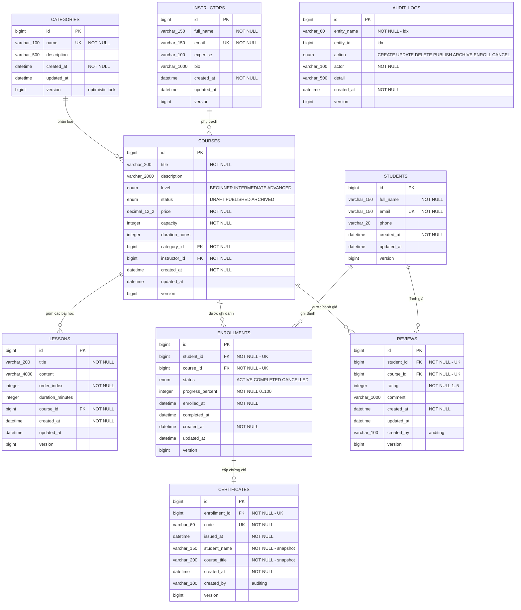

# Thiết kế cơ sở dữ liệu

> Hệ thống quản lý khóa học — Đồ án cuối kỳ **Lập trình ứng dụng với Java (14113014)**
> Tài liệu này mô tả lược đồ CSDL của hệ thống. DDL thực tế xem tại [`schema.sql`](./schema.sql)
> (sinh trực tiếp từ metadata Hibernate, không viết tay).

---

## 1. Sơ đồ quan hệ thực thể (ERD)



### Tóm tắt quan hệ

| Quan hệ | Kiểu | Khóa ngoại | Ánh xạ JPA |
|---|---|---|---|
| Category → Course | 1 — N | `courses.category_id` (NOT NULL) | `@ManyToOne(fetch = LAZY, optional = false)` |
| Instructor → Course | 1 — N | `courses.instructor_id` (NOT NULL) | `@ManyToOne(fetch = LAZY, optional = false)` |
| Course → Lesson | 1 — N | `lessons.course_id` (NOT NULL) | `@OneToMany(cascade = ALL, orphanRemoval = true)` + `@OrderBy("orderIndex ASC")` |
| Student ↔ Course | N — N | qua bảng `enrollments` | Hai `@ManyToOne` trong `Enrollment` |
| Student → Enrollment | 1 — N | `enrollments.student_id` (NOT NULL) | `@ManyToOne(fetch = LAZY, optional = false)` |
| Course → Enrollment | 1 — N | `enrollments.course_id` (NOT NULL) | `@ManyToOne(fetch = LAZY, optional = false)` |
| Student → Review | 1 — N | `reviews.student_id` (NOT NULL) | `@ManyToOne(fetch = LAZY, optional = false)` |
| Course → Review | 1 — N | `reviews.course_id` (NOT NULL) | `@ManyToOne(fetch = LAZY, optional = false)` |
| Enrollment → Certificate | 1 — 0..1 | `certificates.enrollment_id` (NOT NULL, UNIQUE) | `@OneToOne(fetch = LAZY, optional = false)` |

---

## 2. Mô tả chi tiết từng bảng

### 2.1. `categories` — Danh mục khóa học

| Cột | Kiểu | Ràng buộc | Ý nghĩa nghiệp vụ |
|---|---|---|---|
| `id` | `BIGINT` | PK, AUTO_INCREMENT | Khóa chính |
| `name` | `VARCHAR(100)` | NOT NULL, **UNIQUE** | Tên danh mục (Lập trình, Ngoại ngữ, Thiết kế…). Unique để tránh trùng danh mục |
| `description` | `VARCHAR(500)` | | Mô tả ngắn |
| `created_at` | `DATETIME(6)` | NOT NULL, không cập nhật | Thời điểm tạo — Hibernate `@CreationTimestamp` |
| `updated_at` | `DATETIME(6)` | | Thời điểm sửa cuối — `@UpdateTimestamp` |
| `version` | `BIGINT` | | Optimistic locking (`@Version`) |

### 2.2. `instructors` — Giảng viên

| Cột | Kiểu | Ràng buộc | Ý nghĩa nghiệp vụ |
|---|---|---|---|
| `id` | `BIGINT` | PK, AUTO_INCREMENT | Khóa chính |
| `full_name` | `VARCHAR(150)` | NOT NULL | Họ tên giảng viên |
| `email` | `VARCHAR(150)` | NOT NULL, **UNIQUE** | Email — định danh nghiệp vụ, không cho trùng |
| `expertise` | `VARCHAR(100)` | | Chuyên môn (Java, Data, UI/UX…) |
| `bio` | `VARCHAR(1000)` | | Giới thiệu |
| `created_at` / `updated_at` / `version` | | | Kế thừa `BaseEntity` |

### 2.3. `students` — Học viên

| Cột | Kiểu | Ràng buộc | Ý nghĩa nghiệp vụ |
|---|---|---|---|
| `id` | `BIGINT` | PK, AUTO_INCREMENT | Khóa chính |
| `full_name` | `VARCHAR(150)` | NOT NULL | Họ tên học viên |
| `email` | `VARCHAR(150)` | NOT NULL, **UNIQUE** | Email — định danh nghiệp vụ |
| `phone` | `VARCHAR(20)` | | Số điện thoại |
| `created_at` / `updated_at` / `version` | | | Kế thừa `BaseEntity` |

### 2.4. `courses` — Khóa học (thực thể trung tâm)

| Cột | Kiểu | Ràng buộc | Ý nghĩa nghiệp vụ |
|---|---|---|---|
| `id` | `BIGINT` | PK, AUTO_INCREMENT | Khóa chính |
| `title` | `VARCHAR(200)` | NOT NULL | Tên khóa học |
| `description` | `VARCHAR(2000)` | | Mô tả nội dung |
| `level` | `ENUM` | NOT NULL | `BEGINNER` / `INTERMEDIATE` / `ADVANCED` |
| `status` | `ENUM` | NOT NULL, mặc định `DRAFT` | `DRAFT` (đang soạn) → `PUBLISHED` (cho ghi danh) → `ARCHIVED` (ngừng nhận) |
| `price` | `DECIMAL(12,2)` | NOT NULL, mặc định 0 | Học phí. Dùng `DECIMAL` **không** dùng `DOUBLE` để tránh sai số dấu chấm động khi tính tiền |
| `capacity` | `INTEGER` | NOT NULL | Sức chứa tối đa — số học viên `ACTIVE` được phép ghi danh |
| `duration_hours` | `INTEGER` | | Thời lượng dự kiến (giờ) |
| `category_id` | `BIGINT` | NOT NULL, FK → `categories.id` | Mỗi khóa học bắt buộc thuộc một danh mục |
| `instructor_id` | `BIGINT` | NOT NULL, FK → `instructors.id` | Mỗi khóa học bắt buộc có một giảng viên phụ trách |
| `created_at` / `updated_at` / `version` | | | Kế thừa `BaseEntity` |

### 2.5. `lessons` — Bài học

| Cột | Kiểu | Ràng buộc | Ý nghĩa nghiệp vụ |
|---|---|---|---|
| `id` | `BIGINT` | PK, AUTO_INCREMENT | Khóa chính |
| `title` | `VARCHAR(200)` | NOT NULL | Tên bài học |
| `content` | `VARCHAR(4000)` | | Nội dung / mô tả bài học |
| `order_index` | `INTEGER` | NOT NULL | Thứ tự bài trong khóa (1, 2, 3…). Dùng cho `@OrderBy("orderIndex ASC")` |
| `duration_minutes` | `INTEGER` | | Thời lượng bài học (phút) |
| `course_id` | `BIGINT` | NOT NULL, FK → `courses.id` | Bài học không tồn tại độc lập, luôn thuộc một khóa học |
| `created_at` / `updated_at` / `version` | | | Kế thừa `BaseEntity` |

### 2.6. `enrollments` — Ghi danh

| Cột | Kiểu | Ràng buộc | Ý nghĩa nghiệp vụ |
|---|---|---|---|
| `id` | `BIGINT` | PK, AUTO_INCREMENT | Khóa chính |
| `student_id` | `BIGINT` | NOT NULL, FK → `students.id`, UNIQUE(cặp) | Học viên ghi danh |
| `course_id` | `BIGINT` | NOT NULL, FK → `courses.id`, UNIQUE(cặp) | Khóa học được ghi danh |
| `status` | `ENUM` | NOT NULL, mặc định `ACTIVE` | `ACTIVE` (đang học) / `COMPLETED` (đã hoàn thành) / `CANCELLED` (đã hủy) |
| `progress_percent` | `INTEGER` | NOT NULL, mặc định 0 | Tiến độ học 0–100 (%). Đạt 100 → chuyển `COMPLETED` |
| `enrolled_at` | `DATETIME(6)` | NOT NULL | Thời điểm ghi danh (dữ liệu nghiệp vụ, khác `created_at` là dữ liệu kỹ thuật) |
| `completed_at` | `DATETIME(6)` | | Thời điểm hoàn thành, `NULL` nếu chưa xong |
| `created_at` / `updated_at` / `version` | | | Kế thừa `BaseEntity` |

**Ràng buộc duy nhất:**

```sql
ALTER TABLE enrollments
  ADD CONSTRAINT uk_enrollment_student_course UNIQUE (student_id, course_id);
```

### 2.7. `reviews` — Đánh giá khóa học

| Cột | Kiểu | Ràng buộc | Ý nghĩa nghiệp vụ |
|---|---|---|---|
| `id` | `BIGINT` | PK, AUTO_INCREMENT | Khóa chính |
| `student_id` | `BIGINT` | NOT NULL, FK → `students.id`, UNIQUE(cặp) | Học viên viết đánh giá |
| `course_id` | `BIGINT` | NOT NULL, FK → `courses.id`, UNIQUE(cặp) | Khóa học được đánh giá |
| `rating` | `INTEGER` | NOT NULL, 1–5 | Điểm sao. Giới hạn bằng `@Min(1) @Max(5)` ở DTO |
| `comment` | `VARCHAR(1000)` | | Nhận xét |
| `created_at` / `updated_at` / `version` | | | Kế thừa `BaseEntity` |

```sql
ALTER TABLE reviews
  ADD CONSTRAINT uk_review_student_course UNIQUE (student_id, course_id);
```

### 2.8. `certificates` — Chứng chỉ hoàn thành

| Cột | Kiểu | Ràng buộc | Ý nghĩa nghiệp vụ |
|---|---|---|---|
| `id` | `BIGINT` | PK, AUTO_INCREMENT | Khóa chính |
| `enrollment_id` | `BIGINT` | NOT NULL, FK → `enrollments.id`, **UNIQUE** | Mỗi ghi danh chỉ có một chứng chỉ |
| `code` | `VARCHAR(60)` | NOT NULL, **UNIQUE** | Mã tra cứu `CERT-{courseId}-{studentId}-{yyyyMMdd}-{6 ký tự}` |
| `issued_at` | `DATETIME(6)` | NOT NULL | Thời điểm cấp |
| `student_name` | `VARCHAR(150)` | NOT NULL | Tên học viên **tại thời điểm cấp** |
| `course_title` | `VARCHAR(200)` | NOT NULL | Tên khóa học **tại thời điểm cấp** |
| `created_at` / `updated_at` / `version` | | | Kế thừa `BaseEntity` |

### 2.9. `audit_logs` — Nhật ký thao tác

| Cột | Kiểu | Ràng buộc | Ý nghĩa nghiệp vụ |
|---|---|---|---|
| `id` | `BIGINT` | PK, AUTO_INCREMENT | Khóa chính |
| `entity_name` | `VARCHAR(60)` | NOT NULL, index | Thực thể bị tác động (`Course`, `Enrollment`…) |
| `entity_id` | `BIGINT` | index | Khóa chính của bản ghi bị tác động |
| `action` | `ENUM` | NOT NULL, index | `CREATE` / `UPDATE` / `DELETE` / `PUBLISH` / `ARCHIVE` / `ENROLL` / `CANCEL` |
| `actor` | `VARCHAR(100)` | NOT NULL | Người thực hiện (header `X-User`, mặc định `system`) |
| `detail` | `VARCHAR(500)` | | Tên phương thức + tham số rút gọn |
| `created_at` / `updated_at` / `version` | | | Kế thừa `BaseEntity` |

---

## 3. Lý do thiết kế

### 3.1. Vì sao dùng bảng trung gian `Enrollment` thay cho `@ManyToMany` thuần?

Quan hệ Học viên — Khóa học về bản chất là **nhiều–nhiều**. Nếu ánh xạ bằng `@ManyToMany`,
Hibernate sinh ra bảng nối chỉ chứa hai khóa ngoại và **không thể mang thêm dữ liệu**.

Nghiệp vụ thực tế cần lưu thêm: trạng thái ghi danh, tiến độ học, thời điểm ghi danh,
thời điểm hoàn thành. Vì vậy bảng nối phải trở thành một **thực thể độc lập** (`Enrollment`)
với hai quan hệ `@ManyToOne`. Đây là mẫu chuẩn *"association entity"*.

Lợi ích kèm theo: có thể truy vấn trực tiếp trên `enrollments` (đếm số học viên đang học của
một khóa, thống kê tỉ lệ hoàn thành) mà không phải join qua hai bảng lớn.

### 3.2. Vì sao mọi entity kế thừa `BaseEntity`?

`BaseEntity` là `@MappedSuperclass` (không phải `@Entity`) nên **không sinh bảng riêng** —
các cột `id`, `created_at`, `updated_at`, `created_by`, `updated_by`, `version` được "nhúng"
thẳng vào từng bảng con. Tránh lặp lại sáu trường này ở chín entity (nguyên tắc DRY).

`created_by` / `updated_by` do **Spring Data JPA Auditing** tự điền qua `AuditorAware`
(xem `config/JpaAuditingConfig`). Hiện tại hệ thống chưa có xác thực nên người thao tác lấy
từ header `X-User`, mặc định là `system`. Khi bổ sung Spring Security, chỉ cần đổi thân của
`AuditorAware` sang đọc `SecurityContextHolder` — **không phải sửa bất kỳ entity nào**.

### 3.3. Vì sao có cột `version`?

`@Version` bật **optimistic locking**. Tình huống thực tế trong hệ thống: khóa học còn đúng
1 chỗ trống, hai học viên bấm ghi danh cùng lúc. Không có `version`, cả hai giao dịch đều đọc
thấy "còn chỗ" và cùng ghi vào → vượt sức chứa (*lost update*). Có `version`, Hibernate thêm
`WHERE version = ?` vào câu `UPDATE`; giao dịch thứ hai cập nhật 0 dòng và nhận
`OptimisticLockException`.

Chọn optimistic thay vì pessimistic vì hệ thống đọc nhiều hơn ghi, xung đột hiếm; khóa bi quan
sẽ giữ lock ở DB và làm giảm thông lượng.

### 3.4. Vì sao `Course → Lesson` có `cascade = ALL` + `orphanRemoval` còn `Course → Enrollment` thì không?

- **Bài học là thành phần phụ thuộc (composition)**: bài học không có ý nghĩa nếu tách khỏi
  khóa học. Xóa khóa học thì xóa luôn bài học là đúng nghiệp vụ. `orphanRemoval = true` còn
  cho phép xóa bài học chỉ bằng cách gỡ khỏi danh sách `course.getLessons()`.
- **Ghi danh là bản ghi lịch sử độc lập**: nó thuộc về cả học viên lẫn khóa học. Xóa khóa học
  mà xóa luôn ghi danh sẽ **mất dữ liệu học tập của học viên**. Vì vậy không cascade — khóa học
  đang có người ghi danh phải bị chặn xóa ở tầng Service (hoặc chuyển sang `ARCHIVED`).

### 3.5. Vì sao tất cả `@ManyToOne` đều `FetchType.LAZY`?

Mặc định của JPA cho `@ManyToOne` là `EAGER` — mỗi lần nạp một `Course` sẽ kéo theo cả
`Category` và `Instructor` dù có dùng hay không. Khi liệt kê 20 khóa học, đó là 40 truy vấn
thừa (vấn đề **N+1 query**). Đặt `LAZY` cho phép chủ động quyết định khi nào cần dữ liệu liên
quan, và nạp có kiểm soát bằng `JOIN FETCH` / `@EntityGraph` ở đúng chỗ cần.

### 3.6. Vì sao đặt tên tường minh cho `uk_enrollment_student_course`?

Hibernate tự sinh tên ràng buộc dạng `UKt8o6pivur7nn124jehx7cygw5` — khi vi phạm, log lỗi
không đọc được. Ràng buộc chống ghi danh trùng là quy tắc nghiệp vụ quan trọng nhất của hệ
thống nên được đặt tên tường minh trong `@UniqueConstraint(name = "uk_enrollment_student_course")`.

Lưu ý: tầng Service **vẫn kiểm tra trùng trước khi ghi** để trả về thông báo lỗi thân thiện;
ràng buộc ở CSDL là **chốt chặn cuối cùng** cho trường hợp hai request chạy đồng thời.

### 3.7. Vì sao điểm trung bình đánh giá **không** lưu trên bảng `courses`?

Lưu sẵn `average_rating` trên `courses` sẽ nhanh khi đọc, nhưng tạo ra **dữ liệu trùng lặp**:
cùng một sự thật được ghi ở hai nơi. Chỉ cần một đường ghi quên cập nhật (xóa đánh giá, sửa
điểm, nhập liệu trực tiếp vào DB) là hai con số lệch nhau vĩnh viễn và không có cách nào biết
bên nào đúng.

Hệ thống tính điểm bằng **truy vấn gộp** `AVG(rating) GROUP BY course_id`. Cả trang danh sách
chỉ tốn thêm **một** truy vấn, không phụ thuộc số dòng. Khi nào bảng `reviews` lớn tới mức
truy vấn gộp trở thành nút thắt thì mới cân nhắc lưu sẵn — và lúc đó phải kèm cơ chế đồng bộ
(trigger, event, hoặc tính lại định kỳ).

### 3.8. Vì sao `certificates` lưu lại `student_name` và `course_title`?

Đây là **cố ý** phá vỡ chuẩn hóa. Chứng chỉ là giấy tờ **đã phát hành ra ngoài** — học viên
có thể đã tải về, in ra, gửi cho nhà tuyển dụng. Nếu sau này khóa học đổi tên hoặc học viên
đổi họ tên, bản chứng chỉ tra cứu online mà đổi theo thì sẽ không khớp bản đã phát hành.

Vì vậy hai trường này được "chụp" lại tại thời điểm cấp. Đây là kiểu dữ liệu *snapshot* — cùng
lý do với việc hóa đơn lưu lại giá bán tại thời điểm mua thay vì tham chiếu tới giá hiện tại.

### 3.9. Vì sao `audit_logs` không có khóa ngoại?

Nhật ký phải sống lâu hơn dữ liệu nó ghi lại. Nếu đặt khóa ngoại tới `courses`, thì hoặc là
không xóa được khóa học, hoặc là xóa khóa học sẽ xóa luôn nhật ký về nó — cả hai đều làm mất
ý nghĩa của nhật ký. Vì vậy bảng chỉ lưu `entity_name` + `entity_id` dạng phẳng.

Đổi lại, hai chỉ mục `idx_audit_entity (entity_name, entity_id)` và `idx_audit_action (action)`
được tạo tường minh để tra cứu vẫn nhanh khi bảng lớn dần.

### 3.10. Vì sao lưu enum dạng `STRING` chứ không phải `ORDINAL`?

`@Enumerated(EnumType.STRING)` lưu giá trị `"PUBLISHED"` thay vì số thứ tự `1`. Nếu lưu
`ORDINAL`, chỉ cần chèn thêm một hằng số vào giữa danh sách enum là **toàn bộ dữ liệu cũ bị
diễn giải sai**. Lưu chuỗi cũng giúp đọc dữ liệu trực tiếp trong DB dễ hiểu hơn.

---

## 4. Chỉ mục (index) hiện có và đề xuất

**Đã có (do PK / UNIQUE / FK sinh ra):**

| Bảng | Chỉ mục | Nguồn |
|---|---|---|
| tất cả | `PRIMARY KEY (id)` | khóa chính |
| `categories` | `UNIQUE (name)` | ràng buộc unique |
| `instructors`, `students` | `UNIQUE (email)` | ràng buộc unique |
| `enrollments` | `UNIQUE (student_id, course_id)` | ràng buộc nghiệp vụ — cũng phục vụ truy vấn theo `student_id` |
| `reviews` | `UNIQUE (student_id, course_id)` | ràng buộc nghiệp vụ chống đánh giá trùng |
| `certificates` | `UNIQUE (enrollment_id)`, `UNIQUE (code)` | một ghi danh một chứng chỉ; mã tra cứu không trùng |
| `audit_logs` | `INDEX (entity_name, entity_id)`, `INDEX (action)` | khai báo tường minh trong `@Table(indexes = …)` |
| `courses` | index trên `category_id`, `instructor_id` | MySQL tự tạo cho khóa ngoại |

**Đề xuất khi dữ liệu lớn** (chưa áp dụng — xem phần "Hướng phát triển" của báo cáo):

- `INDEX (status)` trên `courses` — endpoint danh sách lọc `PUBLISHED` là truy vấn nóng nhất.
- `INDEX (course_id, status)` trên `enrollments` — dùng khi đếm số học viên đang học để kiểm
  tra sức chứa.
- Cân nhắc chuyển phân trang `OFFSET` sang **keyset pagination** khi bảng vượt vài triệu bản ghi,
  vì `OFFSET n` vẫn phải quét qua `n` dòng bị bỏ.

---

## 5. Quản lý lược đồ theo môi trường

| Profile | CSDL | `ddl-auto` | Ghi chú |
|---|---|---|---|
| `dev` | **MySQL 8** | `update` | Cùng engine với `prod`. Trỏ tới MySQL trong Docker ở `localhost:3307`; lần đầu chạy trên CSDL rỗng thì `DataSeeder` nạp dữ liệu mẫu |
| `prod` | **MySQL 8** | `update` | Giữ lại dữ liệu giữa các lần khởi động (volume `mysql_data`) |
| `test` | H2 in-memory | `create-drop` | Chỉ dành cho bộ test tự động: CSDL dựng lên rồi hủy ngay trong lần chạy |

`dev` và `prod` **dùng chung MySQL 8** để lược đồ sinh ra ở môi trường phát triển đúng bằng lược
đồ chạy thật — kiểu dữ liệu, đối chiếu chuỗi, cách sinh khóa chính và ngữ nghĩa khóa dòng đều
phụ thuộc vào từng CSDL cụ thể.

**Hạn chế đã nhận diện:** `ddl-auto: update` chỉ phù hợp cho đồ án. Trên hệ thống thật, Hibernate
không xóa/đổi cột an toàn và không có lịch sử phiên bản lược đồ. Giải pháp đúng là **Flyway** hoặc
**Liquibase** — mỗi thay đổi là một file migration được version hóa cùng mã nguồn.
